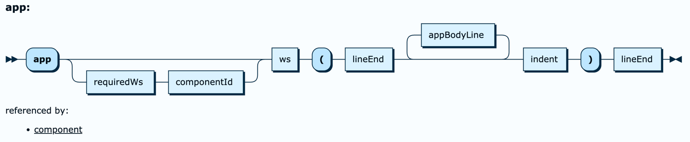

# APEXlang

## Overview

The Open Specification Application Language (APEXlang)
is defined in the [APEXlang API Reference](https://docs.oracle.com/en/database/oracle/apex/26.1/apxln/).

This repository provides a [GitHub workflow](.github/workflows/ci.yml) to convert the original EBNF grammar 
to railroad syntax diagrams with [RR](https://github.com/GuntherRademacher/rr).

## Railroad Syntax Diagrams

The [original EBNF grammar](https://grisselbav.github.io/APEXlang/apexlang.ebnf.txt)
was converted with [Convert.java](Convert.java) to a [W3C EBNF grammar](https://grisselbav.github.io/APEXlang/apexlang.w3c.ebnf.txt) 
as required by [RR](https://github.com/GuntherRademacher/rr).

